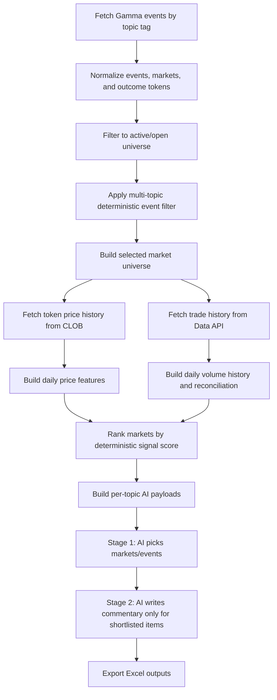

# Polymarket Signal Pipeline

Production-oriented research pipeline for sourcing, filtering, ranking, and summarizing Polymarket markets and events.

This repository turns a notebook-driven workflow into a runnable Python pipeline that:

- fetches active/open events and markets from Polymarket
- applies deterministic business-relevance filtering by topic
- builds historical price and traded-volume datasets
- computes daily market signals and market-level ranking scores
- uses a staged LLM workflow to pick the most relevant markets and events
- exports analyst-friendly Excel outputs

## Why This Exists

Polymarket contains a large and noisy event universe. This project narrows that universe into a business-relevant monitoring system with explicit controls for:

- topic-specific event relevance
- market signal ranking
- AI batch sizing and shortlist caps
- executive-summary hallucination reduction
- historical price and trade-volume export

The design is intentionally hybrid:

- Python handles normalization, filtering, ranking, and export
- the LLM handles selection refinement and commentary generation

## Core Workflow



## Repository Layout

```text
.
├── README.md
├── requirements.txt
├── polymarket_pipeline.py
├── polymarket_pipeline_no_volume.py
├── polymarket_pipeline.txt
├── polymarket_refined.ipynb
├── polymarket_llm_pipeline.py
├── ai_topic_config.json
├── event_filter_config.json
├── event_filter_config.txt
├── export_notebook_to_script.py
└── update_polymarket_notebook.py
```

## Main Entry Point

The primary runnable file is:

- [polymarket_pipeline.py](./polymarket_pipeline.py)

The main orchestration function is:

- `run_pipeline(...)`

The script entry point is:

- `main()`

By default, the pipeline exports outputs to:

- `polymarket_output/`

unless `POLYMARKET_OUTPUT_DIR` is set.

## Features

### 1. Multi-topic event universe construction

The pipeline fetches from default topic tags:

- Politics
- Finance
- Crypto
- Tech
- Geopolitics
- Economy

These are defined in `DEFAULT_TAGS_DF`.

### 2. Deterministic event filtering

Before any AI call, the code filters events using:

- keyword relevance
- event label/tag relevance
- liquidity thresholds
- volume thresholds
- topic-specific configs

Configuration file:

- [event_filter_config.json](./event_filter_config.json)

### 3. Historical price pipeline

The pipeline fetches token history from Polymarket CLOB and constructs:

- raw price history
- daily normalized price features
- rolling z-scores
- momentum and regime-shift indicators

### 4. Historical trade-volume pipeline

The pipeline fetches market trade history using `conditionId` and builds:

- daily trade counts
- token volume
- notional volume
- average and last trade prices
- reconciliation vs snapshot `volume` and `volume24hr`

Important note:

- extremely active markets may be truncated because the public trades API enforces deep pagination limits
- truncated trade histories are explicitly flagged in the pipeline logs and aggregated output

### 5. Deterministic market ranking

Markets are ranked before AI using a composite score built from:

- z-score strength
- z-score shift count
- momentum
- liquidity
- recent volume
- total volume
- time-to-expiry weighting

The final market ranking score is `moving_market_score`.

### 6. Two-stage AI workflow

To reduce hallucination, the LLM does not select and summarize in one pass.

Instead it runs in two stages:

1. shortlist markets and events from structured payloads
2. generate commentary only for the shortlisted items

This staged design is one of the main controls for executive-summary quality.

### 7. Rich Excel exports

The pipeline exports analyst-facing workbooks for:

- AI market picks
- AI event picks
- price history
- daily price + volume history
- volume history
- volume reconciliation
- filtered markets
- selected events
- event tags
- market coverage summaries
- missing-date diagnostics

## Installation

### Python version

Recommended:

- Python 3.9+

### Install dependencies

```bash
pip install -r requirements.txt
```

## Configuration

### Optional proxy settings

If running inside an environment that requires the UBS proxy:

```bash
export UBS_TNUMBER="..."
export UBS_INET_PASSWORD="..."
```

If proxy connectivity fails, the pipeline falls back to direct internet automatically.

### Azure OpenAI settings

AI stages require:

```bash
export AZURE_OPENAI_ENDPOINT="..."
export OPENAI_API_VERSION="..."
export AZURE_OPENAI_DEPLOYMENT="gpt-5.2"
```

Without these values, the deterministic pipeline still runs, but AI selection/commentary will not.

### Topic-level AI controls

Per-topic AI batching and shortlist caps live in:

- [ai_topic_config.json](./ai_topic_config.json)

Examples of controls:

- `market_top_n`
- `event_top_n`
- `top_k_markets`
- `event_batch_size`
- `max_markets_per_batch`
- `final_market_cap`
- `final_event_cap`

### Event filter controls

Per-topic deterministic event filtering lives in:

- [event_filter_config.json](./event_filter_config.json)

Examples of controls:

- `keywords`
- `min_volume`
- `min_liquidity`
- `min_keyword_hits`
- `top_n`

## Usage

### Run from CLI

```bash
python polymarket_pipeline.py
```

### Run with a custom output folder

```bash
POLYMARKET_OUTPUT_DIR=/path/to/output python polymarket_pipeline.py
```

### Run without historical volume

If you want a clean output set that skips the trades API and avoids empty volume workbooks:

```bash
python polymarket_pipeline_no_volume.py
```

This writes to:

- `polymarket_output/no_volume/`

### Run as a module

```python
from pathlib import Path
from polymarket_pipeline import run_pipeline

results = run_pipeline(
    export=True,
    output_dir=Path("./polymarket_output"),
)
```

## Outputs

Typical exported files include:

- `AI Market Pick 10.xlsx`
- `AI Event Pick 10.xlsx`
- `Price History.xlsx`
- `Daily Price Volume History.xlsx`
- `Volume History.xlsx`
- `Volume Reconciliation.xlsx`
- `Market Coverage Summary.xlsx`
- `Market Missing Dates.xlsx`
- `Filtered Markets.xlsx`
- `Events.xlsx`
- `Events Tags.xlsx`

## Logging and Progress

The pipeline prints progress markers for major stages, including:

- `[pipeline]`
- `[fetch]`
- `[normalize]`
- `[universe-topic]`
- `[universe]`
- `[history]`
- `[history-volume]`
- `[ranking]`
- `[ai-payload]`
- `[ai-start]`
- `[ai-shortlist]`
- `[ai-stage2-market]`
- `[ai-stage2-event]`
- `[export]`

These are useful for debugging candidate counts, topic shrinkage, and API/export failures.

## Known Limitations

### Public trades API pagination

The public Polymarket trades endpoint can cap historical activity pagination for very active markets.

Current behavior:

- the pipeline continues running
- affected markets are flagged as truncated
- trade-derived historical volume for those markets should be treated as partial

### Timezone handling

Polymarket APIs return UTC timestamps.

Current behavior:

- timestamps are converted to `US/Eastern` for daily analytics
- Excel exports strip timezone awareness because Excel does not support timezone-aware datetimes

### Notebook lineage

This project started as a notebook workflow and was progressively refactored into a script.

That means:

- the main runtime path is productionized
- some helper organization still reflects notebook evolution

## Development Notes

If you are extending the repo, the best places to start are:

- `run_pipeline(...)` for top-level orchestration
- `build_history_and_feature_data(...)` for historical data logic
- `build_ranked_markets(...)` for signal engineering
- `build_ai_payloads(...)` for topic payload construction
- `run_ai_for_tag_batched(...)` for staged AI selection/commentary
- `export_pipeline_outputs(...)` for final artifacts

## Recommended Next Improvements

- split the monolithic script into modules such as `fetch.py`, `signals.py`, `ai.py`, and `export.py`
- add unit tests around filtering, ranking, and export formatting
- add a `Makefile` or task runner for repeatable local runs
- add CI checks for linting and script compilation
- add a lightweight schema contract for AI outputs
- add a sample `.env.example`

## Improvements Implemented

The current repository already includes a substantial round of hardening and refinement from the original notebook workflow.

### Pipeline and architecture

- converted the notebook workflow into a runnable Python pipeline with `run_pipeline(...)` and `main()`
- added a stable default export directory so runs produce files automatically
- added structured progress logging across fetch, universe, history, ranking, AI, and export stages
- synced a text copy of the main script for easier review and sharing

### Data quality and filtering

- enforced active and open event filtering in the normalized universe
- replaced the legacy AI-based event prefilter with a deterministic multi-topic event filter
- added topic-aware event filtering using configurable keyword, liquidity, and volume thresholds
- expanded event relevance scoring to include event labels and tag labels, not only free text
- externalized event filter settings into `event_filter_config.json`

### Price and volume history

- fixed incomplete daily price-history behavior caused by timestamp handling during reindexing
- changed price-history fetching to use finer-grained data before daily aggregation
- added historical traded-volume collection from the Polymarket trades API
- added trade-volume reconciliation against snapshot `volume` and `volume24hr`
- added combined daily price + volume history output
- added market coverage and missing-date diagnostics
- fixed the missing `conditionId` normalization issue that caused empty volume-history outputs
- hardened the trade-history path for highly active markets by handling the public API pagination cap gracefully
- added explicit logging when trade history is truncated by the API

### AI workflow and hallucination reduction

- changed the AI flow to a two-stage process: shortlist first, commentary second
- separated market picking from event picking
- added per-topic AI batching and shortlist caps via `ai_topic_config.json`
- aligned prompt caps with actual per-topic configuration instead of a hardcoded top-10 assumption
- preserved deterministic signal ordering when applying final market and event caps
- added retry logic for stage-two commentary when the AI returned incomplete coverage
- dropped incomplete AI rows after retry instead of exporting partially populated records

### Export and usability

- added exports for volume history, reconciliation, combined daily price-volume history, and coverage audits
- fixed Excel export failures by converting timezone-aware datetimes to timezone-naive local timestamps
- added repo-level documentation and installation metadata for GitHub consumption

## Backlog

The following ideas are intentionally left as future work.

### Near-term cleanup

- split `polymarket_pipeline.py` into modules such as `fetch`, `history`, `signals`, `ai`, and `export`
- remove notebook-era duplicate imports and tighten dependency hygiene
- replace ad hoc constants with a clearer config layer
- rename legacy helper functions whose names no longer match behavior

### Reliability and testing

- add unit tests for event filtering, signal ranking, and export formatting
- add regression tests for volume history, reconciliation, and truncation handling
- add schema validation for AI responses before materialization
- add smoke tests for a no-AI run and a fully configured AI run

### Repository and developer experience

- add `.env.example`
- add a `LICENSE`
- add GitHub Actions for compile and lint checks
- add issue templates and a pull request template
- add a small `Makefile` or task runner for common commands

### Product and analytics enhancements

- support thematic inheritance across tags, such as letting Economy absorb macro-relevant Finance and Politics markets
- add explicit flags for truncated trade-history markets in exported workbooks
- add richer reconciliation diagnostics for price/volume mismatches
- add topic-level summary sheets for candidate counts, shortlist counts, and final outputs
- add configurable ranking formulas for different business use cases

### AI and research workflow

- add optional human-review checkpoints before final commentary generation
- add structured citation support or evidence snippets in commentary outputs
- add selective reruns for a single topic or a single failed market/event batch
- add prompt versioning so output changes can be audited over time

## Status

Current status:

- actively evolving research/analytics pipeline
- suitable for internal research and analyst workflows
- not yet packaged as a library

## License

No license file has been added yet. If you want this repository to be shareable beyond personal/internal use, add an explicit license.
